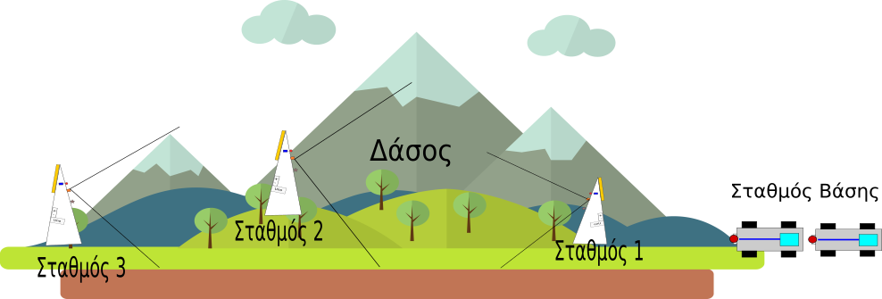

# Διαγωνισμός ΕΛΛΑΚ 2019 - 2020
---
### 2ο Γενικό Λύκειο Ναυπλίου
#### Ομάδα Ρομποτικής:
### Τίτλος Έργου: Αυτοματοποιημένο σύστημα αναγνώρισης δασικών πυρκαγιών και κατάσβεσης.

#### Συμμετέχοντες μαθητές/τριες:
- Καββαθάς Νίκος
- Κολιγκιώνης Κωνσταντίνος
- Κουκουφιλιππου Ιάσονας
- Λέων Γεωργία

#### Υπεύθυνος εκπαιδευτικός:
Λέων Προκόπης ΠΕ86, 2ο ΓΕΛ Ναυπλίου

- [Εισαγωγή](EISAGOGI.md)
- [Πρόταση Κατασκευής](PROTASI.md)
- [Υλικά](YLIKA.md)

Κατασκευή Ομάδα Ρομποτικής 2ου ΓΕΛ Ναυπλίου 2019-20
